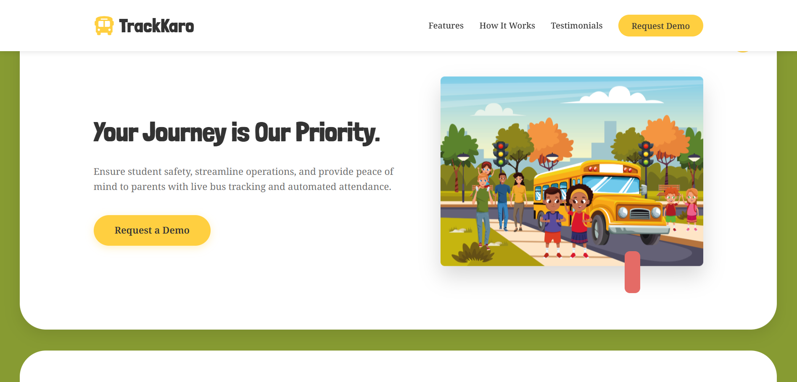
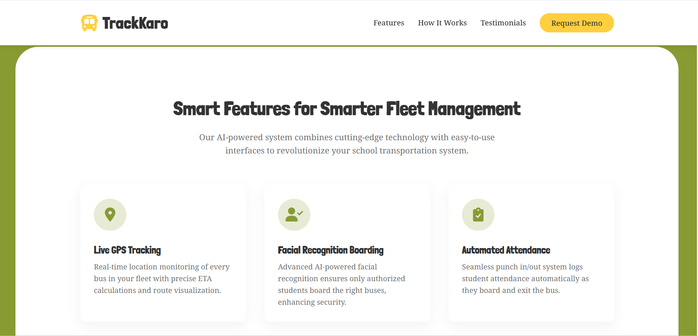
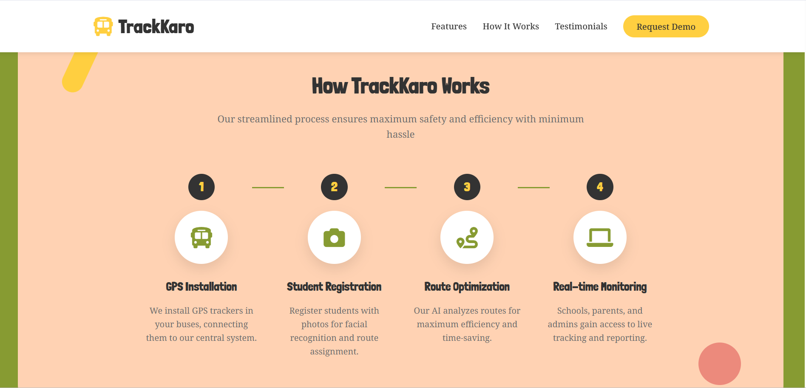
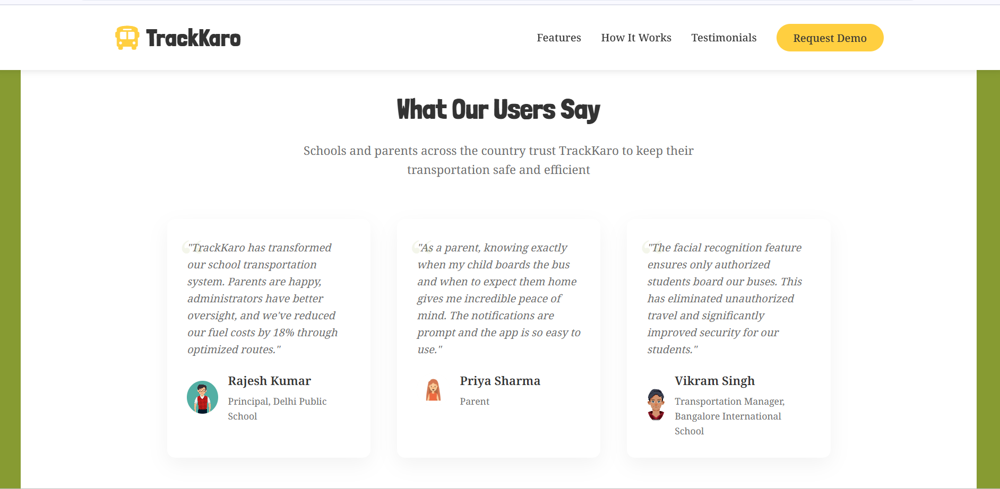

# Trackkaro – Landing Page

Welcome to the **Trackkaro Landing Page** repository!  
Trackkaro is an AI-powered school transportation management system designed to ensure student safety, streamline operations, and provide peace of mind to parents with live bus tracking and automated attendance.

---

## 🚀 Live Demo

Check out the live landing page here:  
[https://trackkaro-landing.vercel.app/](https://trackkaro-landing.vercel.app/)

---

## 🌟 Overview

Our AI-powered system combines cutting-edge technology with easy-to-use interfaces to revolutionize your school transportation system:

- Real-time location monitoring of every bus with precise ETA and route visualization.
- Advanced AI facial recognition to ensure only authorized students board buses.
- Seamless punch in/out system for automatic student attendance logging.
- Instant alerts to parents when their child boards or exits the bus.
- Detailed reports on fuel efficiency, route optimization, and GPS data.
- Built with Flutter for a seamless experience across iOS, Android, and web platforms.

---

## 🖼️ Screenshots

### Page 1

### Page 2

### Page 3

### Page 4

---

## 🛠️ Tech Stack

- Flutter (for cross-platform mobile and web apps)
- AI-powered facial recognition technology
- Real-time GPS tracking and route optimization
- Backend APIs (details in backend repo if applicable)

---

## ✨ Features

- **Live Bus Tracking:** Monitor every bus in your fleet in real-time.
- **AI Facial Recognition:** Ensures only authorized students board the buses.
- **Automated Attendance:** Punch in/out system logs student attendance automatically.
- **Parent Notifications:** Instant alerts on boarding, exiting, and arrival times.
- **Route Optimization:** Detailed analytics to reduce fuel costs and improve efficiency.
- **Multi-Platform:** Accessible on iOS, Android, and web.

---

## ⚡ Getting Started

### 1. Clone the Repository

git clone https://github.com/dhairyadev26/Trackkaro-landing.git
cd Trackkaro-landing

text

### 2. Install Dependencies

If this is a Flutter web project or React-based landing page, install dependencies accordingly:

npm install

or for flutter
flutter pub get

text

### 3. Run Locally

For React or similar:

npm start

text

For Flutter web:

flutter run -d chrome

text

Open [http://localhost:3000](http://localhost:3000) or the URL Flutter provides in your browser.

---

## 🤝 Contributing

Contributions are welcome! Please fork the repository, create a feature branch, and submit a pull request.

---

## 📄 License

This project is licensed under the MIT License. See the [LICENSE](LICENSE) file for details.

---

## 📬 Contact

For questions or support, please open an issue or contact the maintainer.

---

**Your Journey is Our Priority – ensuring safety, efficiency, and peace of mind with Trackkaro.**